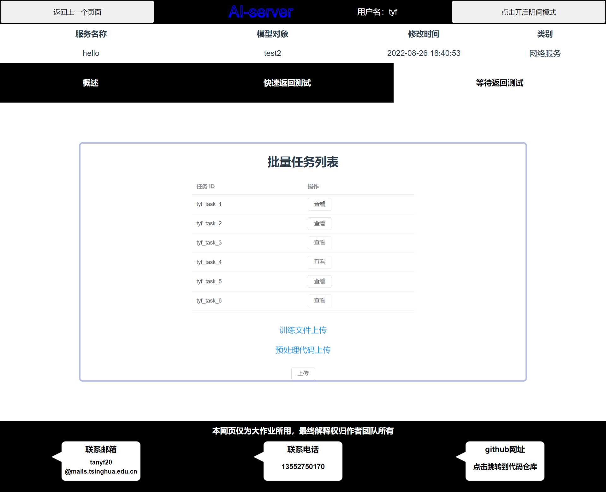
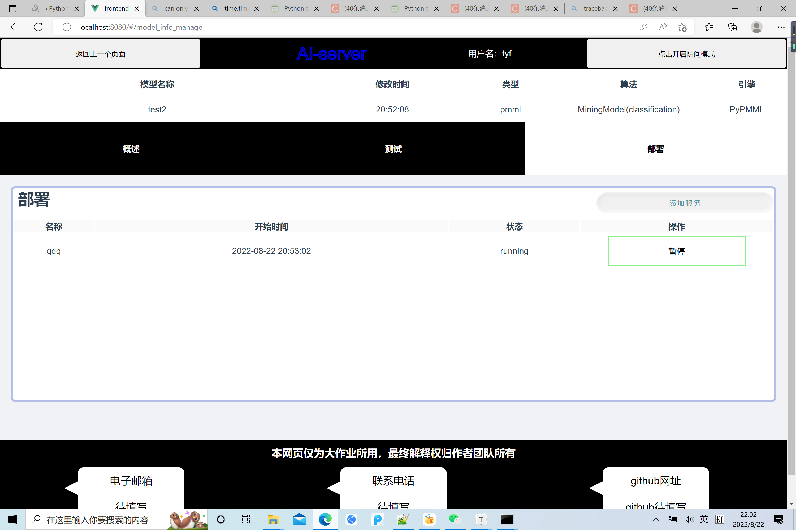

# 模型部署服务大作业文档

组长：2020012351 谭弈凡 

组员：2020012349 王子宁

​			2020012352 林李挚

​			2020012356 林欣涛

​			2020012383 陈睿柯

​			2020012392 张雨恬

项目github网址： [YF-T/ai-server (github.com)](https://github.com/YF-T/ai-server) 

## 目录

- 功能完成情况
- 使用说明
- 前端技术框架
- 后端技术框架
- 分工

## 功能完成情况

### 基本功能（100 分）

- 上传模型（至少包括 pmml 与 onnx 格式），并且上传后能查看模型信息：类似 DaaS 平台的 信息，包括输入（字段名、类型、取值[如有]、维数[如有]）和目标变量（15 分） （完成）
- 能够测试模型，通过表单输入数据（表单项可能是文本也可能是文件，类似 postman）或者 使用 JSON 命令直接输入 JSON 格式的数据，提交后预测结果会显示在界面中（10 分）（完成）
- 部署模型，对外提供 restful api 接口进行调用，支持模型服务的暂停，启动，删除，并且显 示当前服务的状态（25 分） （完成）
- 部署模型后可在前端测试部署的接口，类似于测试模型的界面（使用快速返回接口测试，解 释见下）（25 分） （完成）
- 对外提供的 api 接口分两种：快速返回与等待返回，快速返回接口接受 json 格式的输入，一 次处理一条数据（比如一张图片、一段视频、一段文本或者一些字段与取值），直接返回预测 结果；等待返回接受批量的数据，比如 zip 文件包（里面是图片集、文本文件）、或者 csv 格 式的文件，先返回任务 id（立即返回），之后可通过任务 id 查找结果。（25 分） （完成）

### 加分项

- 验证模型文件的有效性。（5 分） （完成）
- 预留 CPU 和预留内存：为了降低系统的不稳定风险，用户可以选择为部署分配指定的 CPU 核数和内存量。（10 分）（完成）
- 创建自定义实施预测脚本，预处理输入；可进行 API 测试并最终可部署。（20 分）（完成）
- 扩展模型格式，不仅仅包括 pmml 与 onnx。（酌情加分）（未完成）
- 能够监控模型服务，比如显示 Web 服务性能指标：执行次数、平均响应时间、最大最小时间 等。（5 分） （完成）
- 任务管理查看界面。（5 分）（完成）
- 模型服务的伸缩（控制负载均衡，支持高并发请求）。（20 分）（完成）

## 使用说明

### 目录

- 安装
- 运行
- 页面简介
- restful api说明——快速返回与等待返回
- restful api说明——结果查询
- 自定义框架说明
- 注意事项

### 一、安装：

##### 前端部分：

进入前端文件夹`frontend`，在命令行运行`npm install`将依赖项安装在本地node_modules文件夹中


前端由`vue-cli`搭建，此外，需要安装的库有：


##### 后端部分：

进入后端文件夹`backend`，命令行运行`pip install -r requirements.txt`

若需要执行负载均衡或CPU控制详见**后端技术框架：服务性能**。

### 二、运行：

##### 后端部分：

在`backend`文件夹中，执行`python app.py`


##### 前端部分：

在`frontend`文件夹中，执行`npm run serve`，之后点击前端的链接进入页面


### 三、页面简介：

#### 1.所有页面的页眉与页脚：

##### 切换模式：

点击右上角的按钮，可以切换夜间模式和白天模式

##### 查看代码：

点击右下角的气泡跳转到`GitHub`这个项目的代码仓库


#### 2.登录页面/注册页面：

##### 注册：

将鼠标移到AI SERVER字样时会浮出登录框，点击注册，输入自定义的用户名和密码，后端的数据库会记住这个用户，点击返回回到登录界面

##### 登录：

输入之前注册的用户名，或者输入提前准备好的用户（用户名为team，密码为123456）


#### 3.模型管理页面：

##### 模型展示与删除：

展示当前的所有模型的基本资料，如名称、类型、更新时间。通过点击删除按钮，删除这个模型

##### 模型筛选：

上方的搜索框可以按照模型名称展示相对应的模型信息

##### 查看模型信息：

通过点击模型的信息条，可以进入相应模型的信息页面

##### 界面跳转：

点击左上角的按钮返回上一个页面，点击”导入模型“按钮，进入模型导入界面


#### 4.模型导入界面：

##### 导入模型：

选择所有数据之后，点击中间的导入按键，跳转到模型的信息界面

##### 返回：

通过点击返回按键，回到模型管理界面


#### 5.模型信息页面：

##### 页眉
点击页面左上角的 返回上一个页面 按钮即可返回到模型管理页面
##### 概述界面
到导入模型或者点击模型信息表单项后会跳转到模型信息页面，默认显示概述界面，此时会展示该模型所拥有的输入变量以及目标变量。


##### 测试界面

点击导航栏测试将会进入测试界面如下图，该页面主要用于模型测试，支持单文件输入，表单文本输入，表单文件输入，json输入总共四种输入方式，其中单文件输入支持mp4,jpg,txt,csv四种格式，表单文件输入目前只支持jpg输入。进入测试界面默认显示表单文本输入


其中表单输入中可以点击文本框输入与文件输入，实现每个参数单独输入文本或文件。点击下方按钮delete item实现表单清空，点击complete order实现表单提交


点击文件输入按钮切换到单文件输入，单文件支持点击选择文件上传和文件拖拽上传


点击json输入按钮切换到json输入，json输入的多行文本框支持框高随着内容的增加而增加，最终设置五行作为上限，随后出现滚动条


最终提交后右侧输出将会展示最终的结果


##### 部署界面
点击导航栏的部署，进入部署界面，界面将会展示当前已经部署的服务列表，每一个服务都支持暂停，启动，删除三种操作。除此之外，点击服务列表项，将会跳转到对应服务的模型部署页面


点击右上角的添加服务能够为模型添加服务，当前仅需输入部署服务的名称即可实现部署。点击确认即可跳转到部署页面，点击返回即可返回部署服务列表展示界面


#### 6.模型部署页面：
##### 页眉

点击返回到上一个页面按钮即可跳转到模型信息页面

##### 详情页面：

通过标签页切换进入。显示这个模型的基本信息，如平均响应时间、最大响应时间等。


##### 快速返回测试：

输入 Python 预处理代码和 JSON 参数或者文件，点击提交上传。

返回结果如下。


##### 等待返回：

点击按钮进入等待返回测试页面。上传 Python 预处理文件和代码（这个部分没有设置上传文件名显示，如果点击上传后选中文件就是已经选中了，用户依次上传文件最后点击上传即可创建任务），进行等待返回测试。


点击批量任务列表的查看即可查看任务的详细信息,点击返回即可跳转回到等待返回界面


### 四、部署的restful api使用说明——快速返回和等待返回

访问该接口的请求由三部分组成

形式为curl -X POST -F  *文件或数据部分*  -F *预处理脚本部分* *URL部分*

例如

curl -X POST -F file=@"./input.zip" -F prepare_py=@"./user_prepare.py" http://127.0.0.1:5000/testmodel_delayresponse/qqq

#### 1.URL部分

首先要在这个页面生成一个部署，点击添加服务


如图，我生成了一个名叫qqq的部署

之后url为

快速返回：http://127.0.0.1:5000/testmodel_quickresponse/<部署名>

等待返回：http://127.0.0.1:5000/testmodel_delayresponse/<部署名>

将部署名代换成自己的部署名即可

#### 2.文件或数据部分

这部分可以传json（其实就是传字符串）也可以传文件

##### json传输方式：

file={"""sepal length (cm)""":1.0,"""sepal width (cm)""":1.0,"""petal length (cm)""":1.0,"""petal width (cm)""":1.0}

需要注意因为双引号在cmd命令行中会转义，所以要连续输入三个双引号表示一个双引号

##### 文件传输方式

file=@"./input.txt"

格式为file=@"<文件路径>"

#### 3.预处理脚本部分

这部分可以传json（其实就是传字符串）也可以传文件

##### 字符串：

prepare_py="import json @@def prepare(model_input_type,file): @@    print(file)@@    return json.loads(file)"

**需要注意由于命令行不能输入换行，所以可以使用@@代替换行符。**格式为prepare_py="<代码>"

##### 文件

也可以直接传文件

prepare_py=@"./user_prepare.py" 

### 五、部署的restful api使用说明——结果查询

curl -X POST http://127.0.0.1:5000/get_result_delayresponse/<部署名>/<任务id>

即可，任务id为等待返回接口返回的id

### 六、自定义框架说明

~~~python
import json 
import os 
import prepare as default_prepare 
def prepare(input_type, file): 
  if isinstance(file, str): 
    # 如果您传入的是字符串可以直接使用json.loads 
    return json.loads(file) 
  else: 
    filepath = './input_file/' + file.filename 
    file.save(filepath) 
    data = None 
    # todo # 如果您传入的是jpg 
    # data = default_prepare.readimg(input_type[0], filepath, file) 
    # 如果您传入的是mp4 
    # data = default_prepare.readmp4(input_type[0], filepath, file) 
    # 如果您传入的是txt 
    # data = default_prepare.readtxt(input_type, filepath, file)  
    # 如果您传入的是csv 
    # data = default_prepare.readcsv(input_type, filepath, file) 
    # 如果您传入的是zip 
    # data = default_prepare.readzip(input_type, filepath, file) 
    os.remove(filepath) 
    return data
~~~

我们提供了以上的样例代码，用户也可以自行实现这部分代码。

最终需要完成一个函数`prepare`，这个函数的输入为

`input_type`：一个列表，每个元素都是一个五元组，(变量名，变量类型，变量取值，变量维数（只有onnx有），optype（只有pmml有）），其中没有的属性为None。

例如[('input', 'int', '0,1,2,3', '1*8', None),('input', 'int', None, None, 'continuous')]

`file`：一个文件或一个字符串，取决于访问接口时传的是文件还是字符串。

返回值`data`：

### 七、注意事项


## 前端技术框架
### 文件组织
在本次大作业中，前端工作的文件组织主要为以下结构：

#### 路由
```
├── router
│   └── index.ts : 全局路由
```

#### vuex仓库
```
├── store
│   └── argstrans.js : 个人用户前端信息存储
```

#### 顶层组件与公用组件
```
├── App.vue ： 顶层组件
├── components
│   └── user_info.vue 用户信息栏,位于每一个页面的顶部
```

#### 登录注册页面
```
├── views
│   └── login.vue : 登录注册页面
```

#### 模型管理+模型导入页面
```
├── views
│   ├── model_manage.vue : 登录注册页面
│   └── newmodel.vue : 模型导入页面
├── components
│   └── model_manage_item.vue :  模型信息条组件
```

#### 模型信息页面
```
├── views
│   └── model_info_manage.vue : 模型信息页面框架
├── components
│   ├── model_info_manage_overview.vue : 概述组件
│   ├── model_info_manage_test.vue : 模型测试组件
│   ├── model_info_manage_deploy.vue : 模型部署管理与添加组件
│   └── model_info_manage_addserver.vue :  添加部署信息组件
├── static
│   ├── css
│   │   ├── truck.css : 模型测试组件表单输入的提交按钮样式
│   │   └── index.css : 模型测试组件表单输入的清空按钮样式
```

#### web部署页面
```
├── views
│   ├── Deploysum.vue : web部署页面总框架
│   ├── DeployDetail.vue : web部署页面显示web服务性能指标
│   ├── DeployTest.vue : 快速返回测试
│   ├── BatchTaskList.vue : 等待返回测试
│   └── TaskDetail.vue : 任务详情页面
├── components
│   └── CodeViewer.vue :  服务输出代码高亮显示组件
```
### 技术概述

#### ts
本次作业当中大规模使用TypeScript代替JavaScript是本次作业前端工作的一大技术亮点。TypeScript是JavaScript的一个超集，是一种存在类型的脚本语言，其继承了JavaScript的所有变成类型，同时支持JavaScript代码在TypeScript环境下很好的运行。在本次大作业的前端工作当中，主要是看中了TypeScript语言拥有静态类型检查能力，能够在编译期就进行类型检查，确保传输到后端的数据为指定数据类型，极大地提高了网页程序的鲁棒性。除此之外，TypeScript语言支持在所有的浏览器上运行，兼容性较之JavaScript略胜一筹。
#### vuex
Vuex是实现组件全局状态(数据)管理的一种机制，可以方便地实现组件之间数据的共享（一般情况下，只有组件之间共享的数据，才有必要存储到Vuex中）。能够在vuex中集中管理共享的数据，易于开发和后期维护；能够高效地实现组件之间的数据共享，提高开发效率；存储在vuex的数据都是响应式的，能够实时保持数据与页面的同步。vuex在本次大作业中只使用其基础功能，即实现组件间的信息传输，传输用户名，密码，模型名称以及部署名称等信息

#### axios
Vuex中发送网络请求有非常多的方式，传统的Ajax是基于XMLHttpRequest(XHR)，配置和调用方式非常混乱，所以在开发中很少使用，而为什么不使用 jquery-ajax？这是由于在整个前端开发中是不需要使用 jquery的，为了方便我们进行一个网络请求，特意引入一个重量级的框架jquery,得不偿失。axios有非常多的优点，并且使用起来也非常的方便。本次大作业中通过每个页面单独设置axios，以及部分页面创建axios实例，实现前后端之间的简单连接。本次前端还有一大设计亮点在于：**向后端传递数据一定需要传输用户名和密码，这能够有效防止用户绕过页面读取接口数据，有力的保障了网页数据的安全性**
#### prismjs
能够高亮代码，优势是支持配置功能，引入简单。在本次作业中用于高亮显示响应代码。
#### gsap
GSAP全称是GreenSock Animation Platform，是一个js动画框架。任何对象都可以实现动画，不用受限于线性序列，可以重叠动画序列，可以通过精确时间控制，灵活地使用最少的代码实现动画。在vue项目中使用gsap，实现极佳的2d动画效果，主要效果展示在于：模型信息页面中模型测试界面表单输入的清空与提交按钮动画
#### element-plus
UI 库，提供了卡片样式、表单组织、表格页面等功能。用于部署页面。

### 实现细节详解
#### 顶层组件设计
##### 整体框架App.vue
主要布局：
页眉的用户信息栏
```html
<user_info @colorchange="recolor"/>
```
主体页面的路由切换
```html
<router-view/>
```
页脚的联系信息栏
```html
<footer>....</footer>
```
##### 页眉信息栏
这个信息栏在登录页面和模型导入页面是如下图所示

在其他页面显示如下


返回上一个页面按钮实现思路：
通过\$route.path获取当前显示页面的路由,通过简单判断后，使用\$router.push实现页面跳转
```html
<button v-show="$route.path!='/'&&$route.path!='/newmodel'" @click="changeroute">返回上一个页面</button>
```
```js
changeroute(){
  if(this.$route.path == "/model_info_manage")
    this.$router.push('/model_manage')
  else if(this.$route.path == "/model_manage")
    this.$router.push("/")
  else
    this.$router.push("/model_info_manage")
},
```

网页logo以及其流水动画实现思路：
通过两层span嵌套，一层实现空心显示文字框架，另一层实现流水样式过渡动画.其中流水样式通过clip-path路径自定义网页，实现自定义流水路径设计。
```html
<div class="contain">
  <span>AI-server</span>
  <span>AI-server</span>
</div>
```
```js
.contain span:nth-child(1){
  color:transparent;
  -webkit-text-stroke: 2px blue;
}

.contain span:nth-child(2){
  color:blue;
  animation: animate 8s ease-in-out infinite;
}

@keyframes animate {
  0% , 100%{
    clip-path: polygon(0% 50%, 18% 60%, 35% 56%, 50% 51%, 67% 57%, 83% 55%, 100% 45%, 100% 100%, 0 100%);
  }

  25%, 75% {
    clip-path: polygon(0 57%, 17% 69%, 36% 66%, 53% 60%, 69% 65%, 86% 61%, 100% 51%, 100% 100%, 0 100%);
  }

  50%{
    clip-path: polygon(0 74%, 22% 70%, 40% 82%, 62% 81%, 78% 70%, 90% 78%, 100% 90%, 100% 100%, 0 100%);
  }
}
```

用户名显示：
通过从vuex代码仓库直接获取显示，主要代码如下：
```html
<label>用户名：{{store.state.username}}</label>
```

阴间模式的实现思路：
通过父子组件传值，实现点击按钮将点击传到App.vue，实现最高层组件类名在白天与夜间之间切换。在样式上通过设置翻转滤镜实现颜色变化。
主要代码如下：

```js
//user_info.vue中设置如下点击函数
colorchange(){
  this.ifday = -this.ifday;
  this.$emit("colorchange",this.ifday);
}
```
```html
<!--在App.vue中设置如下类名-->
<div :class="ifday===1? 'day' : 'night'">
```
```css
/* 在App.vue中设置如下样式 */
.night{
  filter:invert(1);
}
```

##### 页脚信息栏
基本样式：


点击跳转github仓库按钮实现：
```html
<a href="https://github.com/YF-T/ai-server" target="_blank" style="text-decoration: none;"><span style="font-size:18px;font-weight: bold;line-height: 50px;">点击跳转到代码仓库</span></a>
```

##### 鼠标点击烟花js动画
这部分通过在顶层组件App.vue中为鼠标的按下、抬起、移动等动作设置监视器，捕获鼠标的具体坐标，随后随机生成圆球大小，设置圆球移动缩小动画，最后移除圆球，从而实现整个烟花释放效果。除此之外，本动画对于鼠标长按设定了加大圆球的移动距离的效果，鼠标按下时间越长，圆球移动的距离越远。
主要代码如下：

```js
  window.addEventListener('resize', updateSize, false);
      loop();
      window.addEventListener("mousedown", function(e) {
        pushBalls(randBetween(10, 20), e.clientX, e.clientY);
        document.body.classList.add("is-pressed");
        longPress = setTimeout(function(){
          document.body.classList.add("is-longpress");
          longPressed = true;
        }, 500);
      }, false);
      window.addEventListener("mouseup", function(e) {
        clearInterval(longPress);
        if (longPressed == true) {
          document.body.classList.remove("is-longpress");
          pushBalls(randBetween(50 + Math.ceil(multiplier), 100 + Math.ceil(multiplier)), e.clientX, e.clientY);
          longPressed = false;
        }
        document.body.classList.remove("is-pressed");
      }, false);
      window.addEventListener("mousemove", function(e) {
        let x = e.clientX;
        let y = e.clientY;
        pointer.style.top = y + "px";
        pointer.style.left = x + "px";
      }, false);
```

#### 登录页面
登录页面基本样式如下：

鼠标悬浮在黑白logo上样式如下

点击注册后样式如下：


logo AISERVER的流水动画与页面信息栏的设计相同此处不在赘述

##### 鼠标悬浮文字分割动画的实现：

这部分仅使用css，通过设置了两个同样的流水logo动画，但是其中一个使用clip-path设置只展示上一半，另一个同样设置clip-path展示下一半，如此悬浮后只需要上下两半分别沿其方向移动即可实现该动画。除此之外，通过给logo的文字色彩设置混合模式，文字会显示出与背景色相反的颜色，使其更加显眼。
主要代码如下：

```html
<div class="contain">
  <span>AIserver</span>
  <span>AIserver</span>
</div>
<div class="contain">
  <span>AIserver</span>
  <span>AIserver</span>
</div>
```
```css
h2 div[class="contain"]:nth-child(1){
  ....
  clip-path: polygon(0 0,100% 0,100% 50%,2% 50%);
  ....
}

h2:hover div[class="contain"]:nth-child(1){
  transform: translateY(-108px);
}

h2 div[class="contain"]:nth-child(2){
  .....
  clip-path: polygon(0 50%,100% 50%,100% 100%,0% 100%);
  .....
  mix-blend-mode: difference;/* 文字色彩的混合模式，实现字体颜色与背景色相反 */
}

h2:hover div[class="contain"]:nth-child(2){
  transform: translateY(120px);
}
```

##### 登录注册页面的切换：

采用v-if和v-else的方式，点击注册或者返回将会修改islogin的值从而实现页面的切换

```html
<div class="center" v-if="islogin===1">...</div>
<div class="center" v-else>...</div>
```
#### 模型管理页面

##### 筛选显示：

通过输入的模型名称来显示相对应的模型，由filter变量绑定这个输入。需要注意的是为了防止没有输入时，所有模型都不显示这一情况出现，需要对filter先进行判断非空。

```html
<label>搜索(依据模型名称)  </label><input type='text' v-model="filter"/>
...
<div class = "center" v-for = "item in data" v-show = "show(item.modelname)">
```

```javascript
show(name:string){
      if (this.filter == '')
          return true
      return name == this.filter
    },
```

##### 模型信息：

每个模型用一个vue组件model_manage_item实现，传入相关的参数。

```html
<model_manage_item :modelname="item.modelname" :modeltype="item.modeltype" :time="item.time" @itemdelete="newmodeldata"></model_manage_item>

```

从后端获取该用户所有的模型信息，路径为”/upload“，使用 Mounted 钩子在组件挂载时将后端传来的数据存入data中

```javascript
showdata() {
  let param = new FormData();
  param.append('user', this.store.state.username);
  param.append('password', this.store.state.password);
  var path = 'http://127.0.0.1:5000/getusermodel ';
  axios.post(path, param)
      .then(response => {
        this.data = response.data.model
      });
}
```

#### 模型导入页面

##### 页面结构：

用grid表格形式作为页面的结构，为了看起来更为规整、美观，增加了一些没有功能的区域。

```css
#main{
  display:grid;
  grid-template-rows:33% 33% 34%;
  grid-template-columns:33% 33% 34%;
}
```

对于每个小区域，使用中心辐射的渐变方式，并且通过标签的hover和active属性，实现鼠标进入该区域或点击该区域的形态变化，出现蓝色的选中框

```css
background-image: radial-gradient(black,grey)

#main div:hover{
  border: skyblue thick solid;
  background-image: radial-gradient(white,grey);
  transition: background-image 1s;
}

#main div:active{
  background-image: linear-gradient(white,black);
}
```

##### 数据提交：

先将文件输入到前端，保存在data中的file变量。

```html
<input id="inputfile" type="file" ref="fileId" @change="getFile">
```

```javascript
getFile(){
      //获取file内容
      let files:any = this.$refs.fileId;
      this.file = files.files[0];
      //this.filename = this.file.name;
    },
```

获取当前系统的时间，按照YY:MM:DD和HH:MM:SS的格式重新组织，并为只有一位数的时间补上0。

```javascript
getvalue(){
      var date = new Date();
      //年 getFullYear()：四位数字返回年份
      var year = date.getFullYear(); //getFullYear()代替getYear()
      //月 getMonth()：0 ~ 11
      var month = date.getMonth() + 1;
      //日 getDate()：(1 ~ 31)
      var day = date.getDate();
      //时 getHours()：(0 ~ 23)
      var hour = date.getHours();
      //分 getMinutes()： (0 ~ 59)
      var minute = date.getMinutes();
      //秒 getSeconds()：(0 ~ 59)
      var second = date.getSeconds();

      var time = year + '-' + this.addZero(month) + '-' + this.addZero(day) + ' ' + this.addZero(hour) + ':' + this.addZero(minute) + ':' + this.addZero(second);
      return time;
    }

addZero(s:number) {
        return s < 10 ? ('0' + s) : s;
    }
```

对于axios返回的错误，对应不同的错误，给出相应的提示，以便于使用者快速找到问题，上传正确文件。

```javascript
if(response.data.errortype === 'can\'t save model')
{alert("对不起，您的模型上传失败了！原因是模型存入数据库过程出错");}
else if(response.data.errortype === 'model is invalid')
{alert("对不起，您的模型上传失败了！原因是模型无效");}
else if(response.data.errortype === '’can\'t get model‘')
{alert("对不起，您的模型上传失败了！原因是接收不到模型");
```

#### 模型信息页面
##### 信息页面框架


模型名称数据从vuex仓库获取,修改时间，类型，算法，引擎从后端获取数据进行展示

下面的导航栏使用v-show实现四个界面组件的切换，同时设置了悬浮动画
主要代码如下：
```html
<nav>
  <ul class="item">
    <li><a @click="show(1)" :class="index===1? 'active':'no'">概述</a></li>
    <li><a @click="show(2)" :class="index===2? 'active':'no'">测试</a></li>
    <li><a @click="show(3)" :class="index===3 || index===4? 'active':'no'">部署</a></li>
	  </ul>
</nav>
```
##### 概述界面


这部分的信息展示都是通过axios从后端获取数据；除此之外，这部分根据pmml和onnx模型的不同使用v-if和v-else展示不同的表格头

##### 测试界面
进入测试界面后默认展示表单输入，此时每一个表单项默认使用文本框输入


此时的文本框输入（表单文本框输入和json输入的文本框）使用多行文本框，同时支持文本框的高度随着其中的内容高度变化。这部分的实现是通过在多行文本框外层套一个div，然后将多行框的内容同步给div，这是由于div自动具备高度随着内容变化，同时设置div为不显示状态，反馈回div的高度来设置textarea的高度，从而实现了文本框的高度随着内部内容的高度变化。最后给textarea设置了最大高度，最大能够容纳五行文字后出现滑动条
```html
<div class="parent" v-else>
  <div class="dummy" name='point'></div>
  <textarea class="textarea" v-on:input="test(i)" v-model="valuelist[i]"></textarea>
</div>
```
```js
test(i:number){
  let s1=document.getElementsByName("point")[i];
  s1.textContent = this.valuelist[i];
},
```
```css
word-break:break-all;/* 支持div和textarea文字断行 */
```

单文件输入支持点击上传和拖拽输入：
点击上传使用传统的input[type='file']并为其设置一个label样式用for与input绑定，即可实现点击点击上传文字实现打开文件浏览对话框来选择文件。
拖拽上传需要阻断文件拖拽的悬浮以及拖拽的放入两个浏览器自带功能，然后通过e.dataTransfer.files[0] 获取到第一个上传的文件对象。
支持拖拽以及点击重新选择修改上传文件。
主要代码如下：
```js
//点击上传
chooseUploadFile (e:any) { 
  const file = e.target.files.item(0)
  if (!file) return
  this.batchFile = file
  this.fileName = file.name
  // 清空，防止上传后再上传没有反应
  e.target.value = ''
},
// 拖拽上传
fileDragover (e:any) {
  e.preventDefault()
},
fileDrop (e:any) {
  e.preventDefault()
  const file = e.dataTransfer.files[0] // 获取到第一个上传的文件对象
  if (!file) return
  this.batchFile = file
  this.fileName = file.name
},
```

表文输入的表单清空按钮delete item和提交按钮complete order按钮，通过使用单独的css样式文件以及gsap这个效果优异的2d动画库以及部分JavaScript代码，实现这部分动画。主要参考代码源自<a href="https://cloud.tencent.com/developer/article/1704412">点击跳转</a>

##### 部署界面

```
```js
pagechange(index:number){
  this.$emit('pagechange',index);
},
```

#### web部署页面
**概述页面**：使用 element-plus 的 ElTable 组件，使用 onMounted 钩子，在组件挂载时请求 /get_deployment_info/<deployment> 接口，将信息封装为类型为 Indicator 的信息。<br/>
**快速返回**：采用左右布局的方式，左侧为请求表单，右侧为返回响应，均用 ElCard 组件承载。左侧表单使用 ElForm 组织。文件上传上由于 ElUpload 组建需要上传文件的接口，跟后端接口设计不符合，因此采用原生 input 标签。访问<br/>
**等待返回**：使用 ElTable 显示任务以及操作，可以上传文件来完成。<br/>
**任务详情**：通过 ElCard 显示结果。通过路由参数获取任务id, 再在 store 里查询详情信息，并请求后端 /getdeploymenttask 获取结果。请求结果使用 CodeViewer 显示。<br/>

## 后端技术框架

### 目录

- 文件组织
- 技术说明
- 接口信息
- 服务性能

后端的结构基本如下图所示：


### 文件组织


### 技术说明

#### 数据交互

我们采用sqlite数据库。采用数据库可以在节省内存，并且在服务停机后仍然能够保留数据，便于调试，测试服务。sqlite数据库是一个轻量级的数据库，在python中可以调用其对应的管理库sqlite3进行管理。此外，sqlite数据库也是一个关系型数据库，我们的模型数据，部署数据等等因为其经常需要用一种属性来查询另一种属性，因此非常适合使用关系型数据库。

##### 对数据库的操作

我们主要有四种对数据库的操作。

第一种是查找，我们在数据库的使用函数中调用sqlite的命令，例如：

~~~python
c.execute('SELECT modelname, modeltype, time FROM models WHERE user = ?', (user,))
~~~

即在models表单中查找user对应的所有条目的模型名，模型类型和创建时间。查找使用sqlite中的SELECT语句。

~~~python
row = c.fetchone()
answer = c.fetchall()
~~~

选择后使用fetchone或fetchall来获取一条满足条件的条目或是所有满足条件的条目。

第二种是插入，我们在数据库的使用函数中调用sqlite的命令，例如：

~~~python
c.execute('INSERT INTO delayresponsetasks VALUES (?,?,?,?,?)', 
                    (user, taskid, modelname, deployment, 'None'))
~~~

即在delayresponsetasks表单中插入一行数据。插入使用INSERT语句。插入操作之后需要commit我们做的修改。

第三种是修改，我们在数据库的使用函数中调用sqlite的命令，例如：

~~~python
c.execute('''UPDATE deployments SET status = ?
                    WHERE user = ? AND modelname = ? AND deployment = ?''' , 
                    (status, user, modelname, deployment))
~~~

即修改deployments表单中所有满足WHERE的条件的表单项的status。修改使用UPDATE语句。修改操作之后需要commit我们做的修改。

第四种是删除，我们在数据库的使用函数中调用sqlite的命令，例如：

~~~python
c.execute('DELETE FROM models WHERE user = ? AND modelname = ?', 
                    (user, modelname))
~~~

即删除models表单中所有满足后面条件的表单项。删除使用DELETE语句。删除之后需要commit提交我们的修改。

##### 数据库维护的表单

我们的数据库维护了五个表单，分别管理用户、模型、模型变量、部署、等待返回id。

~~~python
c.execute('''CREATE TABLE users 
                        (user TEXT, password TEXT, roll TEXT, 
                        modelid NUMBER, delayresponsetaskid NUMBER, 
                        waittaskid NUMBER);''')
~~~

第一个是用户表单（users）。用户表单记录用户信息，维护了用户的用户名、密码、身份（管理员/普通用户，便于以后的开发）、模型id（用于后续写id系统）、任务id（用于给等待返回的task分配不重复的id，这个表单项从1开始往上加）、部署id（用于后续写id系统）。一般使用用户名作为索引去获取其他信息。

~~~python
c.execute('''CREATE TABLE models 
                        (user TEXT, modelid NUMBER, 
                        modelname TEXT, modeltype TEXT, 
                        time TEXT, modelroute TEXT, 
                        algorithm TEXT, engine TEXT, 
                        description TEXT);''')
~~~

第二个是模型表单（models）。模型表单存储模型信息，维护了模型所属的用户，模型的id（供以后的id系统使用），模型名，模型类型，模型创建时间，模型文件的存储路径，模型算法，模型使用引擎，模型描述。一般使用用户或着使用用户和模型名一起来作为索引查找对应的表单项。

~~~python
c.execute('''CREATE TABLE variables 
                        (user TEXT, id NUMBER, modelname TEXT, 
                        inout TEXT, name TEXT, 
                        type TEXT, value TEXT, dim TEXT, optype TEXT);''')
~~~

第三个是模型变量表（variables）。模型变量表存储模型变量的信息，因为一个模型往往有多个输入变量和输出变量，所以这部分不存在模型表单中。模型变量表单维护了模型所属用户名，模型id（供以后的id系统使用），模型名，输入变量/输出变量（取值为input或output），变量名，变量类型，变量取值，维数，optype。通常使用用户名+模型名作为索引。

~~~python
c.execute('''CREATE TABLE deployments 
                        (user TEXT, modelname TEXT, 
                        deployment TEXT, status TEXT, time TEXT, 
                        times INTEGER, averagecost REAL, 
                        maxcost REAL, mincost REAL, 
                        firstvisit TEXT, lastvisit TEXT);''')
~~~

第四个是部署表单（deployments）。部署表单存储部署信息和部署的性能信息，维护了用户名，模型名，部署名，部署状态（启动/暂停），创建时间，访问次数，平均响应时间，最大响应时间，最小响应时间，第一次访问的日期时间，最后一次访问的日期时间。因为部署名是全局唯一的，所以只要用部署名作为索引即可。

~~~python
c.execute('''CREATE TABLE delayresponsetasks
                        (user TEXT, id TEXT, 
                        modelname TEXT, deployment TEXT, file TEXT);''')
~~~

第五个是等待返回任务表单（delayresponsetasks）。该表单主要存储部署之后的等待返回任务，维护了用户名，任务id，模型名，部署名，存储结果文件名的信息。一般使用部署名+任务id作为索引查询存储结果文件名。

#### 模型运行

##### pmml
使用pypmml库中的model实现。
~~~python
model = Model.fromFile(address)
output = model.predict(data)
~~~
从文件中加载模型，之后利用模型的predict函数预测。
##### onnx
使用onnxruntime库实现。
~~~python
sess = ort.InferenceSession(address)  # 加载模型
output = sess.run(None, input)
~~~
从文件中读取模型，之后利用run方法预测。

#### 模型有效性判断

对pmml文件：

​		1、判断其作为xml文件是否是良构的。具体实现为：调用`xml.etree`库中的`ElementTree`模块，直接使用try..except语句调用parse方法，若调用成功，则xml文件时良构的。

​		2、验证其是否符合对应版本的pmml规则。具体实现为：从pmml官网上下载不同版本（3.1-4.4.1）的pmml对应的`xsd`文件，使用`generateDS` 解析 XSD 文件，生成相应的 Python module并储存在`backend/check_pmml_xsd`文件夹中。接收pmml文件后读取其版本，并调用对应版本的moudle，与验证xml良构性相似，使用parse方法以验证pmml文件的正确性。

对onnx文件:

​		直接调用onnx库的`onnx.checker.check_model()`来验证模型的有效性

#### 读取模型信息

对pmml文件：

​		先从`Mining Schema`中获得输入变量和预测变量的变量名（通过`usageType`属性判断是预测变量还是输入变量），然后到`DataDictionary`中寻找对应变量的其他信息，如数据类型、取值、维数、测量等等。

对onnx文件：

​		读入模型后，直接调用`onnxruntime`库的`onnx_session.get_inputs()`和`onnx_session.get_outputs()`获取变量信息。

#### 模型服务监控
可以通过前端接口查看当前部署的模型服务的性能指标（仅限快速返回），实现方式为：
* 在数据库内为每个模型维护如下变量：`deployment-部署名称`，`times-执行次数`，`averagecost-平均响应时间`，`maxcost-最大响应时间`，`mincost-最小响应时间`，`firstvisit-第一次访问时间点`，`lastvisit-最近一次访问时间点`；
* 每次调用快速返回接口时，使用`database.setdeploymentperformance`函数更新上述变量；
* 当前端发出监控服务性能的申请时，使用`database.getdeploymentperformance`函数返回上述指标。


#### 自定义预处理
##### 接口设计
我们在设计接口时，除了需要用户传入参数外，也需要用户传入一个python脚本。python脚本中需要包括一个prepare函数。在接口函数中，我们会将脚本保存在`user_prepare.py`后用`importlib`模块重新导入这个模块，之后执行这个模块的prepare函数完成数据的预处理。

##### 预处理函数
为了方便使用，我们为用户提供了几种常见输入文件的预处理函数，文件格式包括：`.jpg`，`.txt`，`.mp4`，`jpg/mp4格式的base64编码`，`.csv`，`.zip`。用户可以通过直接修改下方函数（比如根据传入文件的类型取消部分代码的注释），完成简单的预处理工作。该函数存储在主目录下的`sample_for_user.py`中。
```python
import json
import os
import prepare as preprocess
def prepare(input_type, file):
    if isinstance(file, str):
        # 如果您传入的是字符串可以直接使用json.loads
        return json.loads(file)
    else:
        filepath = './input_file/' + file.filename
        file.save(filepath)
        data = None
        
        # todo
        # 如果您传入的是jpg
        # data = preprocess.readimg(input_type[0], filepath, file)
        # 如果您传入的是mp4
        # data = preprocess.readmp4(input_type[0], filepath, file)
        # 如果您传入的是txt
        # data = preprocess.readtxt(input_type, filepath, file)
        # 如果您传入的是csv
        # data = preprocess.readcsv(input_type, filepath, file)
        # 如果您传入的是zip
        # data = preprocess.readzip(input_type, filepath, file)
        
        os.remove(filepath)
        return data
```

### 接口信息

我们的所有接口全部写在app.py中

#### 登陆页面接口

##### /login (post)：登录

访问数据库的users表单，在其中查找用户对应的密码是否与输入的密码相符合。

##### /register (post)：注册用户

先判重，如果用户名不重复在users表单中新建一项。

#### 模型管理页面接口

##### /getusermodel (post)：获取某用户下的所有模型

在数据库中的models表单下查询指定用户的所有模型，返回简略信息。

##### /deletemodel (post)：删除某个模型

在数据库中删除指定模型。模型文件的回收由存储释放接口统一处理。

#### 模型导入页面接口

##### /upload(post)：上传模型

接收前端上传的模型并储存，验证有模型效性，读取模型信息（包括模型算法、输入（字段名、类型、取值[如有]、维数[如有]）和目标变量），并储存在数据库中

#### 模型信息页面接口

##### /getmodelinfo(post)：获取一个模型的详细信息

接收前端发来的模型名，用户名和密码，在models表单中查询相关信息，返回一个详细信息。

#### 模型测试页面接口

##### /testmodel_test(post)：测试模型

接收前端发来的测试数据，返回预测结果。其中前端发来数据之后首先要判断测试数据的类型（是字符串还是文件），之后调用相应的文件处理器进行处理。目前我们支持文件为jpg、txt、csv、mp4。此外，我们本身还支持json传输。

处理后得到统一的几种格式，之后使用模型预测技术进行预测，将结果返回。

#### 模型部署页面接口

##### /createdeployment (post)：创建一个部署

在数据库中的deployments表单中新增一条记录。

##### /deletedeployment (post)：删除一个部署

在数据库中清除一个部署和其对应的所有信息，包括等待返回task等等。

##### /setdeploymentstatusrunning (post)：把一个部署设为运行状态

改变数据库中的deployments表单的状态为运行。

##### /setdeploymentstatuspause (post)：把一个部署设为暂停状态

改变数据库中的deployments表单的状态为暂停。

##### /getmodeldeployment (post)：获取一个模型的所有部署

在数据库的deployments表单中查询某一模型对应的所有部署并返回简略信息。

#### restful api

##### /testmodel_quickresponse/\<deployment> (post)：快速返回API

先解析数据，判断输入是文件还是字符串。之后将用户输入的预处理函数保存在`user_prepare.py`里，使用该预处理函数解析输入的数据。之后使用模型预测数据，返回结果。在这个过程中还会监控模型服务的性能，存入数据库。

##### /testmodel_delayresponse/\<deployment> (post)：等待返回API

先解析数据，判断输入是文件还是字符串。之后将用户输入的预处理函数保存在`user_prepare.py`里，使用该预处理函数解析输入的数据。之后开一个多线程进行模型预测数据，直接返回任务id。多线程预测结果存储在文件里。

##### /get_result_delayresponse/\<deployment>/\<taskid> (post)：查询等待返回结果API

在数据库中根据id找到对应的文件，从文件中读出数据，返回结果。

##### /get_deployment_info/\<deployment\> (post)：查询当前服务性能

从数据库中读取当前模型的性能数据，返回。

#### 部署等待返回结果查询页面

##### /getdeploymenttask (post)：获取部署对应的所有taskid的列表

从数据库的delayresponsetasks表单中筛选所有的该部署下的等待返回id。

#### 其他

##### /restart (post)：清空存储和数据库

重建所需的四个文件夹，并清空存储。

### 服务性能

这一部分需要用到`docker+k8s`模块。
#### docker镜像搭建：

首先本地安装docker。在后端根目录下创建`Dockerfile`，将需要安装的第三方库写成`requirements.txt`文件形式，从而可以使用`DockerFile`快速搭建镜像。文件中未指定`python`版本，且第三方库通过清华镜像站安装，原则上能够适应各种运行环境。
```DockerFile
FROM python
ENV PATH /usr/local/bin:$PATH
ADD . /
WORKDIR /
RUN pip config set global.index-url https://pypi.tuna.tsinghua.edu.cn/simple
RUN /usr/local/bin/python -m pip install --upgrade pip
RUN pip install opencv-python-headless
RUN pip install -r requirements.txt
CMD ["python", "app.py"]
```
使用以下命令创建镜像（其中`ai-server`为项目名，可以更换为任意自定义名称）：
```powershell
docker build -f Dockerfile -t ai-server .
```
创建完成后，可以使用`docker images`查看镜像。执行命令`docker run ai-server`，命令行显示以下结果，说明镜像成功运行：


接下来使用`python-k8s`接口，为了能够创建`k8s`环境，首先需要在本地安装`kubectl`，指令为：

```shell
curl -LO "https://dl.k8s.io/release/v1.25.0/bin/windows/amd64/kubectl.exe"
```

我们利用已经创建好的`docker`镜像，生成了相应的`yaml`配置文件。将其保存为`backend/deployment.yaml`，进一步配置创建`k8s`的容器(`pod`)的各种属性。容器创建指令为：

```shell
kubectl create -f deployment.yaml
```

如果用户有需要，可以通过调整`deployment.yaml`中的参数，并在服务器上部署服务，实现以下功能：
#### 分配指定CPU核数和内存量

```yaml
    spec:
      containers:
      - image: ai-server
        name: ai-server
        imagePullPolicy: Never
        resources: {}
        requests:
          cpu: 1
          memory: 1Gi
        limits:
          cpu: 2
          memory: 2Gi
        # 以上代码设置说明：
        # 所有容器的内存请求总和不能超过1 GiB
        # 所有容器的内存限制总和不能超过2 GiB
        # 所有容器的 CPU 请求总和不能超过1 cpu
        # 所有容器的 CPU 限制总和不能超过2 cpu
```
需要修改模型部署时`pod`的副本数，只需修改`replicas`这一参数即可，初始默认值为1。
#### 模型伸缩（高并发/负载均衡）

```yaml
# 自动伸缩设置
spec:
  maxReplicas: 5
  minReplicas: 1
  scaleTargetRef:
    apiVersion: apps/v1
    kind: Deployment
    name: ai-server
  targetCPUUtilizationPercentage: 70
  # 当pod使用一个cpu的百分比大于最大限制的70%时会触发扩容，最多扩大到5个pod
```
这样就实现了分配指定CPU核数和内存量+模型伸缩（高并发/负载均衡）的相关功能。

## 分工

以下按学号排序

### 前端

- 王子宁：登录注册页面框架搭建，模型管理页面，模型导入功能
- 林李挚：完成web部署页面的概述、快速返回测试、等待返回测试、等待返回任务详情页面，部分代码完善优化
- 林欣涛：前端工作统筹分工，登录注册页面css样式优化，完成模型信息页面的概述、模型测试、部署服务添加，前端整体代码完善优化，前后端接口调试

### 后端

- 谭弈凡：组长，后端框架设计，用户、模型、部署和等待返回任务的信息管理（数据库的创建与维护），模型测试接口调试，自定义框架调试，项目整体代码完善优化
- 陈睿柯：模型测试接口函数，快速返回与等待返回接口函数，部分自定义预处理框架搭建，模型伸缩（高并发、负载均衡）与CPU分类控制功能搭建，模型服务监控，前端界面优化
- 张雨恬：接收模型文件并读取模型信息，验证模型有效性，部分自定义预处理框架搭建，等待返回多线程执行及结果存取，部分模型测试接口和自定义框架调试