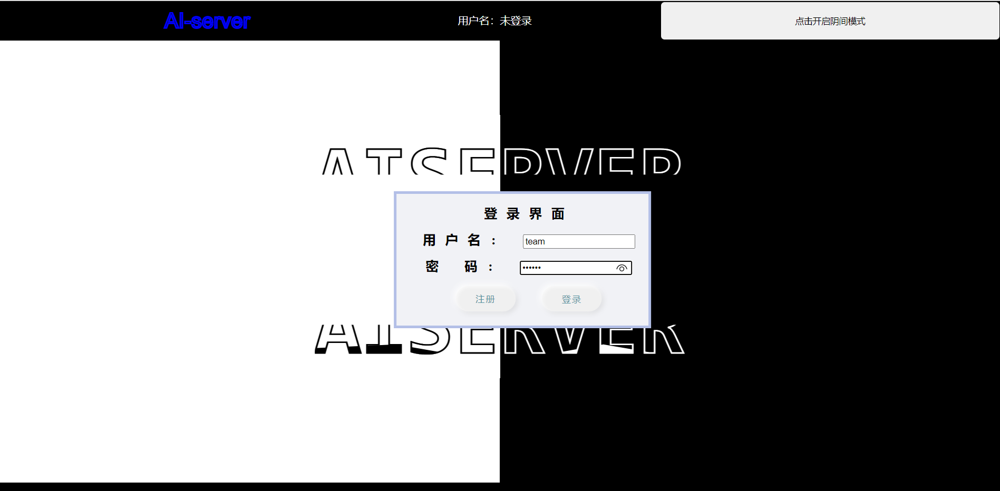

# 文档

## 功能完成情况

## 使用说明

### 一、安装：

##### 前端部分：

进入前端文件夹`frontend`，在命令行运行`npm install`将依赖项安装在本地node_modules文件夹中

前端由`vue-cli`搭建，此外，需要安装的库有：

##### 后端部分：

进入后端文件夹`backend`，运行`pip install -r requirements.txt`

新建五个文件夹：`input_file，model，output，textfile，example`

### 二、运行：

##### 后端部分：

在`backend`文件夹中，执行`python app.py`

##### 前端部分：

在`frontend`文件夹中，执行`npm run serve`，之后点击前端的链接进入页面

### 三、页面简介：

#### 1.所有页面的页眉与页脚：

##### 切换模式：

点击右上角的按钮，可以切换夜间模式和白天模式

##### 查看代码：

点击右下角的气泡跳转到`GitHub`这个项目的代码仓库

#### 2.登录页面/注册页面：

##### 注册：

将鼠标移到AI SERVER字样时会浮出登录框，点击注册，输入自定义的用户名和密码，后端的数据库会记住这个用户，点击返回回到登录界面

##### 登录：

输入之前注册的用户名，或者输入提前准备好的用户（用户名为team，密码为123456）

#### 3.模型管理页面：

##### 展示模型：

展示当前的所有模型的基本资料，如名称、类型、更新时间。通过点击删除按钮，删除这个模型

##### 模型筛选：

上方的搜索框可以按照模型名称展示相对应的模型信息

##### 查看模型信息：

通过点击模型的信息条，可以进入相应模型的信息页面

##### 界面跳转：

点击左上角的按钮返回上一个页面，点击”导入模型“按钮，进入模型导入界面

#### 4.模型导入界面：

##### 导入模型：

选择所有数据之后，点击中间的导入按键，跳转到模型的信息界面

##### 返回：

通过点击返回按键，回到模型管理界面

#### 5.模型信息页面：

#### 6.模型部署页面：
通过标签页切换。
详情页面

快速。输入 Python 预处理代码和 JSON 参数或者文件，点击提交上传。

返回结果如图。

等待返回。上传 Python 预处理文件和代码。

## 前端技术框架
### 文件组织

### 技术概述(主要是使用的依赖插件,讲述该技术的优势以及在本次作业中的应用)

1.ts 例：使用ts相比于js的优势，ts在这次作业中主要的应用地方
2.vuex
3.axios
4.prismjs
能够高亮代码，优势是支持配置功能，引入简单。在本次作业中用于显示响应代码。
5.gsap
6.element-plus
UI 库，提供了卡片样式、表单组织、表格页面等功能。用于部署页面。
7.router？

### 实现细节详解（每个部分不一定包括，也不限于：1，页面截图+简单布局介绍；2，接口处如何从前端获取信息以及从后端接受信息反馈，将信息进行展示；3，亮点css或者js样式动画；4.可以对照大作业得分点介绍自己页面的完成情况，5............................）
#### 登录页面

#### 模型管理页面+模型导入页面

#### 模型信息页面(概述，测试，部署)

#### web部署页面(概述，快速返回，等待返回，任务详情)
**概述页面**：使用 element-plus 的 ElTable 组件，使用 onMounted 钩子，在组件挂载时请求 /get_deployment_info/<deployment> 接口，将信息封装为类型为 Indicator 的信息。
**快速返回**：采用左右布局的方式，左侧为请求表单，右侧为返回响应，均用 ElCard 组件承载。左侧表单使用 ElForm 组织。文件上传上由于 ElUpload 组建需要上传文件的接口，跟后端接口设计不符合，因此采用原生 input 标签。访问
**等待返回**：使用 ElTable 显示任务以及操作，可以上传文件来完成。
**任务详情**：通过 ElCard 显示结果。通过路由参数获取任务id, 再在 store 里查询详情信息，并请求后端 /getdeploymenttask 获取结果。请求结果使用 CodeViewer 显示。

## 后端技术框架
后端的结构基本如下图所示：

### 文件组织

### 技术概述

#### 数据交互

我们采用sqlite数据库，sqlite数据库是一个轻量级的数据库，在python中可以调用其对应的管理库sqlite3进行管理……

我们主要有四种对数据库的操作。
第一种是查找，我们在数据库的使用函数中调用sqlite的命令，例如：

~~~
c.execute('SELECT modelname, modeltype, time FROM models WHERE user = ?', (user,))
~~~

即在models表单中查找user对应的所有条目的模型名，模型类型和创建时间。……

第二种是插入

第三种是修改

第四种是删除

#### 模型运行

#### 模型正确性判断

#### 自定义预处理

### 接口信息

#### 登陆页面接口

##### /login (post)：登录

访问数据库的user表单，在其中查找用户对应的密码是否与输入的密码相符合。

##### /register (post)：注册

#### 模型管理页面接口