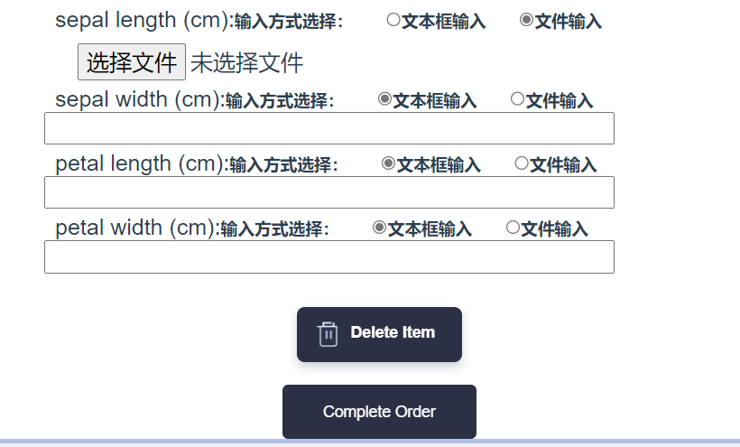

# 文档

## 功能完成情况


## 使用说明

### 一、安装：

##### 前端部分：

进入前端文件夹`frontend`，在命令行运行`npm install`将依赖项安装在本地node_modules文件夹中


前端由`vue-cli`搭建，此外，需要安装的库有：


##### 后端部分：

进入后端文件夹`backend`，命令行运行`pip install -r requirements.txt`

新建五个文件夹：`input_file，model，output，textfile，example`

### 二、运行：

##### 后端部分：

在`backend`文件夹中，执行`python app.py`


##### 前端部分：

在`frontend`文件夹中，执行`npm run serve`，之后点击前端的链接进入页面


### 三、页面简介：

#### 1.所有页面的页眉与页脚：

##### 切换模式：

点击右上角的按钮，可以切换夜间模式和白天模式

##### 查看代码：

点击右下角的气泡跳转到`GitHub`这个项目的代码仓库


#### 2.登录页面/注册页面：

##### 注册：

将鼠标移到AI SERVER字样时会浮出登录框，点击注册，输入自定义的用户名和密码，后端的数据库会记住这个用户，点击返回回到登录界面

##### 登录：

输入之前注册的用户名，或者输入提前准备好的用户（用户名为team，密码为123456）


#### 3.模型管理页面：

##### 模型展示与删除：

展示当前的所有模型的基本资料，如名称、类型、更新时间。通过点击删除按钮，删除这个模型

##### 模型筛选：

上方的搜索框可以按照模型名称展示相对应的模型信息

##### 查看模型信息：

通过点击模型的信息条，可以进入相应模型的信息页面

##### 界面跳转：

点击左上角的按钮返回上一个页面，点击”导入模型“按钮，进入模型导入界面


#### 4.模型导入界面：

##### 导入模型：

选择所有数据之后，点击中间的导入按键，跳转到模型的信息界面

##### 返回：

通过点击返回按键，回到模型管理界面


#### 5.模型信息页面：

##### 页眉
点击页面左上角的 返回上一个页面 按钮即可返回到模型管理页面
##### 概述界面

到导入模型或者点击模型信息表单项后会跳转到模型信息页面，默认显示概述界面，此时会展示该模型所拥有的输入变量以及目标变量。

##### 测试界面

点击导航栏测试将会进入测试界面如下图，该页面主要用于模型测试，支持单文件输入，表单文本输入，表单文件输入，json输入总共四种输入方式，其中单文件输入支持mp4,jpg,txt,csv四种格式，表单文件输入目前只支持jpg输入。进入测试界面默认显示表单文本输入


其中表单输入中可以点击文本框输入与文件输入，实现每个参数单独输入文本或文件。点击下方按钮delete item实现表单清空，点击complete order实现表单提交


点击文件输入按钮切换到单文件输入，单文件支持点击选择文件上传和文件拖拽上传


点击json输入按钮切换到json输入，json输入的多行文本框支持框高随着内容的增加而增加，最终设置五行作为上限，随后出现滚动条


最终提交后右侧输出将会展示最终的结果


##### 部署界面
点击导航栏的部署，进入部署界面，界面将会展示当前已经部署的服务列表，每一个服务都支持暂停，启动，删除三种操作。除此之外，点击服务列表项，将会跳转到对应服务的模型部署页面


点击右上角的添加服务能够为模型添加服务，当前仅需输入部署服务的名称即可实现部署。点击确认即可跳转到部署页面，点击返回即可返回部署服务列表展示界面


#### 6.模型部署页面：
##### 详情页面：

通过标签页切换进入。显示这个模型的基本信息，如平均响应时间、最大响应时间等。


##### 快速返回测试：

输入 Python 预处理代码和 JSON 参数或者文件，点击提交上传。

返回结果如下。


##### 等待返回：

点击按钮进入等待返回测试页面。上传 Python 预处理文件和代码，进行等待返回测试。


## 前端技术框架
### 文件组织
在本次大作业中，前端工作的文件组织主要为以下结构：

#### 路由
```
├── router
│   └── index.ts : 全局路由
```

#### vuex仓库
```
├── store
│   └── argstrans.js : 个人用户前端信息存储
```

#### 顶层组件与公用组件
```
├── App.vue ： 顶层组件
├── components
│   └── user_info.vue 用户信息栏,位于每一个页面的顶部
```

#### 登录注册页面
```
├── views
│   └── login.vue : 登录注册页面
```

#### 模型管理+模型导入页面
```
├── views
│   ├── model_manage.vue : 登录注册页面
│   └── newmodel.vue : 模型导入页面
├── components
│   └── model_manage_item.vue :  模型信息条组件
```

#### 模型信息页面
```
├── views
│   └── model_info_manage.vue : 模型信息页面框架
├── components
│   ├── model_info_manage_overview.vue : 概述组件
│   ├── model_info_manage_test.vue : 模型测试组件
│   ├── model_info_manage_deploy.vue : 模型部署管理与添加组件
│   └── model_info_manage_addserver.vue :  添加部署信息组件
├── static
│   ├── css
│   │   ├── truck.css : 模型测试组件表单输入的提交按钮样式
│   │   └── index.css : 模型测试组件表单输入的清空按钮样式
```

#### web部署页面
```
├── views
│   ├── Deploysum.vue : web部署页面总框架
│   ├── DeployDetail.vue : web部署页面显示web服务性能指标
│   ├── DeployTest.vue : 快速返回测试
│   ├── BatchTaskList.vue : 等待返回测试
│   └── TaskDetail.vue : 任务详情页面
├── components
│   └── CodeViewer.vue :  服务输出代码高亮显示组件
```
### 技术概述

#### ts
本次作业当中大规模使用TypeScript代替JavaScript是本次作业前端工作的一大技术亮点。TypeScript是JavaScript的一个超集，是一种存在类型的脚本语言，其继承了JavaScript的所有变成类型，同时支持JavaScript代码在TypeScript环境下很好的运行。在本次大作业的前端工作当中，主要是看中了TypeScript语言拥有静态类型检查能力，能够在编译期就进行类型检查，确保传输到后端的数据为指定数据类型，极大地提高了网页程序的鲁棒性。除此之外，TypeScript语言支持在所有的浏览器上运行，兼容性较之JavaScript略胜一筹。
#### vuex
Vuex是实现组件全局状态(数据)管理的一种机制，可以方便地实现组件之间数据的共享（一般情况下，只有组件之间共享的数据，才有必要存储到Vuex中）。能够在vuex中集中管理共享的数据，易于开发和后期维护；能够高效地实现组件之间的数据共享，提高开发效率；存储在vuex的数据都是响应式的，能够实时保持数据与页面的同步。vuex在本次大作业中只使用其基础功能，即实现组件间的信息传输，传输用户名，密码，模型名称以及部署名称等信息

#### axios
Vuex中发送网络请求有非常多的方式，传统的Ajax是基于XMLHttpRequest(XHR)，配置和调用方式非常混乱，所以在开发中很少使用，而为什么不使用 jquery-ajax？这是由于在整个前端开发中是不需要使用 jquery的，为了方便我们进行一个网络请求，特意引入一个重量级的框架jquery,得不偿失。axios有非常多的优点，并且使用起来也非常的方便。本次大作业中通过每个页面单独设置axios，以及部分页面创建axios实例，实现前后端之间的简单连接。
#### prismjs
能够高亮代码，优势是支持配置功能，引入简单。在本次作业中用于高亮显示响应代码。
#### gsap
GSAP全称是GreenSock Animation Platform，是一个js动画框架。任何对象都可以实现动画，不用受限于线性序列，可以重叠动画序列，可以通过精确时间控制，灵活地使用最少的代码实现动画。在vue项目中使用gsap，实现极佳的2d动画效果，主要效果展示在于：模型信息页面中模型测试界面表单输入的清空与提交按钮动画
#### element-plus
UI 库，提供了卡片样式、表单组织、表格页面等功能。用于部署页面。

### 实现细节详解（每个部分不一定包括，也不限于：1，页面截图+简单布局介绍；2，接口处如何从前端获取信息以及从后端接受信息反馈，将信息进行展示；3，亮点css或者js样式动画；4.可以对照大作业得分点介绍自己页面的完成情况，5............................）
#### 顶层组件设计
##### 整体框架App.vue
主要布局：
页眉的用户信息栏
```html
<user_info @colorchange="recolor"/>
```
主体页面的路由切换
```html
<router-view/>
```
页脚的联系信息栏
```html
<footer>....</footer>
```
##### 页眉信息栏
这个信息栏在登录页面和模型导入页面是如下图所示

在其他页面显示如下


返回上一个页面按钮实现思路：
通过\$route.path获取当前显示页面的路由,通过简单判断后，使用\$router.push实现页面跳转
```html
<button v-show="$route.path!='/'&&$route.path!='/newmodel'" @click="changeroute">返回上一个页面</button>
```
```js
changeroute(){
  if(this.$route.path == "/model_info_manage")
    this.$router.push('/model_manage')
  else if(this.$route.path == "/model_manage")
    this.$router.push("/")
  else
    this.$router.push("/model_info_manage")
},
```

网页logo以及其流水动画实现思路：
通过两层span嵌套，一层实现空心显示文字框架，另一层实现流水样式过渡动画.其中流水样式通过clip-path路径自定义网页，实现自定义流水路径设计。
```html
<div class="contain">
  <span>AI-server</span>
  <span>AI-server</span>
</div>
```
```js
.contain span:nth-child(1){
  color:transparent;
  -webkit-text-stroke: 2px blue;
}

.contain span:nth-child(2){
  color:blue;
  animation: animate 8s ease-in-out infinite;
}

@keyframes animate {
  0% , 100%{
    clip-path: polygon(0% 50%, 18% 60%, 35% 56%, 50% 51%, 67% 57%, 83% 55%, 100% 45%, 100% 100%, 0 100%);
  }

  25%, 75% {
    clip-path: polygon(0 57%, 17% 69%, 36% 66%, 53% 60%, 69% 65%, 86% 61%, 100% 51%, 100% 100%, 0 100%);
  }

  50%{
    clip-path: polygon(0 74%, 22% 70%, 40% 82%, 62% 81%, 78% 70%, 90% 78%, 100% 90%, 100% 100%, 0 100%);
  }
}
```

用户名显示：
通过从vuex代码仓库直接获取显示，主要代码如下：
```html
<label>用户名：{{store.state.username}}</label>
```

阴间模式的实现思路：
通过父子组件传值，实现点击按钮将点击传到App.vue，实现最高层组件类名在白天与夜间之间切换。在样式上通过设置翻转滤镜实现颜色变化。
主要代码如下：
```js
//user_info.vue中设置如下点击函数
colorchange(){
  this.ifday = -this.ifday;
  this.$emit("colorchange",this.ifday);
}
```
```html
<!--在App.vue中设置如下类名-->
<div :class="ifday===1? 'day' : 'night'">
```
```css
/* 在App.vue中设置如下样式 */
.night{
  filter:invert(1);
}
```

##### 页脚信息栏
基本样式：


点击跳转github仓库按钮实现：
```html
<a href="https://github.com/YF-T/ai-server" target="_blank" style="text-decoration: none;"><span style="font-size:18px;font-weight: bold;line-height: 50px;">点击跳转到代码仓库</span></a>
```

##### 鼠标点击烟花js动画
这部分通过在顶层组件App.vue中为鼠标的按下、抬起、移动等动作设置监视器，捕获鼠标的具体坐标，随后随机生成圆球大小，设置圆球移动缩小动画，最后移除圆球，从而实现整个烟花释放效果。除此之外，本动画对于鼠标长按设定了加大圆球的移动距离的效果，鼠标按下时间越长，圆球移动的距离越远。
主要代码如下：
```js
  window.addEventListener('resize', updateSize, false);
      loop();
      window.addEventListener("mousedown", function(e) {
        pushBalls(randBetween(10, 20), e.clientX, e.clientY);
        document.body.classList.add("is-pressed");
        longPress = setTimeout(function(){
          document.body.classList.add("is-longpress");
          longPressed = true;
        }, 500);
      }, false);
      window.addEventListener("mouseup", function(e) {
        clearInterval(longPress);
        if (longPressed == true) {
          document.body.classList.remove("is-longpress");
          pushBalls(randBetween(50 + Math.ceil(multiplier), 100 + Math.ceil(multiplier)), e.clientX, e.clientY);
          longPressed = false;
        }
        document.body.classList.remove("is-pressed");
      }, false);
      window.addEventListener("mousemove", function(e) {
        let x = e.clientX;
        let y = e.clientY;
        pointer.style.top = y + "px";
        pointer.style.left = x + "px";
      }, false);
```

#### 登录页面
登录页面基本样式如下：

鼠标悬浮在黑白logo上样式如下

点击注册后样式如下：


logo AISERVER的流水动画与页面信息栏的设计相同此处不在赘述

鼠标悬浮文字分割动画的实现
这部分仅使用css，通过设置了两个同样的流水logo动画，但是其中一个使用clip-path设置只展示上一半，另一个同样设置clip-path展示下一半，如此悬浮后只需要上下两半分别沿其方向移动即可实现该动画。除此之外，通过给logo的文字色彩设置混合模式，文字会显示出与背景色相反的颜色，使其更加显眼。
主要代码如下：
```html
<div class="contain">
  <span>AIserver</span>
  <span>AIserver</span>
</div>
<div class="contain">
  <span>AIserver</span>
  <span>AIserver</span>
</div>
```
```css
h2 div[class="contain"]:nth-child(1){
  ....
  clip-path: polygon(0 0,100% 0,100% 50%,2% 50%);
  ....
}

h2:hover div[class="contain"]:nth-child(1){
  transform: translateY(-108px);
}

h2 div[class="contain"]:nth-child(2){
  .....
  clip-path: polygon(0 50%,100% 50%,100% 100%,0% 100%);
  .....
  mix-blend-mode: difference;/* 文字色彩的混合模式，实现字体颜色与背景色相反 */
}

h2:hover div[class="contain"]:nth-child(2){
  transform: translateY(120px);
}
```

登录注册页面的切换
采用v-if和v-else的方式，点击注册或者返回将会修改islogin的值从而实现页面的切换
```html
<div class="center" v-if="islogin===1">...</div>
<div class="center" v-else>...</div>
```
#### 模型管理页面+模型导入页面

#### 模型信息页面(概述，测试，部署)

#### web部署页面(概述，快速返回，等待返回，任务详情)
**概述页面**：使用 element-plus 的 ElTable 组件，使用 onMounted 钩子，在组件挂载时请求 /get_deployment_info/<deployment> 接口，将信息封装为类型为 Indicator 的信息。<br/>
**快速返回**：采用左右布局的方式，左侧为请求表单，右侧为返回响应，均用 ElCard 组件承载。左侧表单使用 ElForm 组织。文件上传上由于 ElUpload 组建需要上传文件的接口，跟后端接口设计不符合，因此采用原生 input 标签。访问<br/>
**等待返回**：使用 ElTable 显示任务以及操作，可以上传文件来完成。<br/>
**任务详情**：通过 ElCard 显示结果。通过路由参数获取任务id, 再在 store 里查询详情信息，并请求后端 /getdeploymenttask 获取结果。请求结果使用 CodeViewer 显示。<br/>

## 后端技术框架
后端的结构基本如下图所示：


### 文件组织


### 技术概述

#### 数据交互

我们采用sqlite数据库。采用数据库可以在节省内存，并且在服务停机后仍然能够保留数据，便于调试，测试服务。sqlite数据库是一个轻量级的数据库，在python中可以调用其对应的管理库sqlite3进行管理。此外，sqlite数据库也是一个关系型数据库，我们的模型数据，部署数据等等因为其经常需要用一种属性来查询另一种属性，因此非常适合使用关系型数据库。

##### 对数据库的操作

我们主要有四种对数据库的操作。
第一种是查找，我们在数据库的使用函数中调用sqlite的命令，例如：

~~~python
c.execute('SELECT modelname, modeltype, time FROM models WHERE user = ?', (user,))
~~~

即在models表单中查找user对应的所有条目的模型名，模型类型和创建时间。……

第二种是插入

第三种是修改

第五个是等待返回任务表单（delayresponsetasks）。该表单主要存储部署之后的等待返回任务，维护了用户名，任务id，模型名，部署名，存储结果文件名的信息。一般使用部署名+任务id作为索引查询存储结果文件名。

#### 模型运行


#### 模型有效性判断

对pmml文件：

​		1、判断其作为xml文件是否是良构的。具体实现为：调用`xml.etree`库中的`ElementTree`模块，直接使用try..except语句调用parse方法，若调用成功，则xml文件时良构的。

​		2、验证其是否符合对应版本的pmml规则。具体实现为：从pmml官网上下载不同版本（3.1-4.4.1）的pmml对应的`xsd`文件，使用`generateDS` 解析 XSD 文件，生成相应的 Python module并储存在`backend/check_pmml_xsd`文件夹中。接收pmml文件后读取其版本，并调用对应版本的moudle，与验证xml良构性相似，使用parse方法以验证pmml文件的正确性。

对onnx文件:

​		直接调用onnx库的`onnx.checker.check_model()`来验证模型的有效性

#### 读取模型信息

对pmml文件：

​		先从`Mining Schema`中获得输入变量和预测变量的变量名（通过`usageType`属性判断是预测变量还是输入变量），然后到`DataDictionary`中寻找对应变量的其他信息，如数据类型、取值、维数、测量等等。

对onnx文件：

​		读入模型后，直接调用`onnxruntime`库的`onnx_session.get_inputs()`和`onnx_session.get_outputs()`获取变量信息。

#### 模型服务监控
可以通过前端接口查看当前部署的模型服务的性能指标（仅限快速返回），实现方式为：
* 在数据库内为每个模型维护如下变量：`deployment-部署名称`，`times-执行次数`，`averagecost-平均响应时间`，`maxcost-最大响应时间`，`mincost-最小响应时间`，`firstvisit-第一次访问时间点`，`lastvisit-最近一次访问时间点`；
* 每次调用快速返回接口时，使用`database.setdeploymentperformance`函数更新上述变量；
* 当前端发出监控服务性能的申请时，使用`database.getdeploymentperformance`函数返回上述指标。


#### 自定义预处理
##### 接口设计
（待补充）

##### 预处理函数
为了方便使用，我们为用户提供了几种常见输入文件的预处理函数，文件格式包括：`.jpg`，`.txt`，`.mp4`，`jpg/mp4格式的base64编码`，`.csv`，`.zip`。用户可以通过直接修改下方函数（比如根据传入文件的类型取消部分代码的注释），完成简单的预处理工作。该函数存储在主目录下的`sample_for_user.py`中。
```python
import json
import os
import prepare as preprocess
def prepare(input_type, file):
    if isinstance(file, str):
        # 如果您传入的是字符串可以直接使用json.loads
        return json.loads(file)
    else:
        filepath = './input_file/' + file.filename
        file.save(filepath)
        data = None
        
        # todo
        # 如果您传入的是jpg
        # data = preprocess.readimg(input_type[0], filepath, file)
        # 如果您传入的是mp4
        # data = preprocess.readmp4(input_type[0], filepath, file)
        # 如果您传入的是txt
        # data = preprocess.readtxt(input_type, filepath, file)
        # 如果您传入的是csv
        # data = preprocess.readcsv(input_type, filepath, file)
        # 如果您传入的是zip
        # data = preprocess.readzip(input_type, filepath, file)
        
        os.remove(filepath)
        return data
```

### 接口信息

#### 登陆页面接口

##### /login (post)：登录

访问数据库的users表单，在其中查找用户对应的密码是否与输入的密码相符合。

##### /register (post)：注册用户

先判重，如果用户名不重复在users表单中新建一项。

#### 模型管理页面接口

##### /getusermodel (post)：获取某用户下的所有模型

在数据库中的models表单下查询指定用户的所有模型，返回简略信息。

#### 模型导入页面接口

##### /upload(post)：上传模型

接收前端上传的模型并储存，验证有模型效性，读取模型信息（包括模型算法、输入（字段名、类型、取值[如有]、维数[如有]）和目标变量），并储存在数据库中

#### 模型信息页面接口

##### /getmodelinfo(post)：获取一个模型的详细信息

接收前端发来的模型名，用户名和密码，在models表单中查询相关信息，返回一个详细信息。

#### 模型测试页面接口

##### /testmodel_test(post)：测试模型

接收前端发来的测试数据，返回预测结果。其中前端发来数据之后首先要判断测试数据的类型（是字符串还是文件），之后调用相应的文件处理器进行处理。目前我们支持文件为jpg、txt、csv、mp4。此外，我们本身还支持json传输。

处理后得到统一的几种格式，之后使用模型预测技术进行预测，将结果返回。

#### 模型部署页面接口

#### 服务性能
这一部分需要用到`docker+k8s`模块。
##### docker镜像搭建：
首先本地安装docker。在后端根目录下创建`Dockerfile`，将需要安装的第三方库写成`requirements.txt`文件形式，从而可以使用`DockerFile`快速搭建镜像。文件中未指定`python`版本，且第三方库通过清华镜像站安装，原则上能够适应各种运行环境。
```DockerFile
FROM python
ENV PATH /usr/local/bin:$PATH
ADD . /
WORKDIR /
RUN pip config set global.index-url https://pypi.tuna.tsinghua.edu.cn/simple
RUN /usr/local/bin/python -m pip install --upgrade pip
RUN pip install opencv-python-headless
RUN pip install -r requirements.txt
CMD ["python", "app.py"]
```
使用以下命令创建镜像（其中`ai-server`为项目名，可以更换为任意自定义名称）：
```powershell
docker build -f Dockerfile -t ai-server .
```
创建完成后，可以使用`docker images`查看镜像。执行命令`docker run ai-server`，命令行显示以下结果，说明镜像成功运行：

##### 分配指定CPU核数和内存量

##### 模型伸缩（高并发/负载均衡）